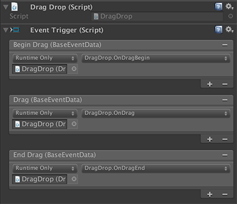

# Drag and Drop in uGUI

A practise of universal interaction in Unity UI (uGUI): Drag and drop an game object for exchanging its position with others.

[中文版](./README_CN.md)

## Main Feature

In a game object group which is arranged by Unity UI grid system, when you drag one game object and drop it at some place in the group's area, the game object will exchange its position with the other one which is closest to the dropping place.

## Environment and Dependency Plugins

- **Unity** ver. 5.6.6f2
- **DOTween** ver. 1.1.310

## Implementation Method

1. Store the matrix Order and initial Position of every DragDrop GameObject.
2. When a game object (DragDrop Handler) is being dragged, get the matrix Order and realtime Position of it.
3. When the DragDrop GameObject is dropped, get the nearest GameObject by the dropping place's position and store the matrix Order of that game object (Replaced GameObject).
4. Exchange the DragDrop Handler GameObject's matrix Order with the Replaced GameObject.
5. Change the two GameObjects' Position by DOTween. You can also use your own tween ways.

## How to Use

### Scripts Structure

```txt
_Components/DragDrop/
├── DragDropContainer.cs  // Attached to the container of objects.
├── DragDropObject.cs  // Attached to the object substance.
└── DragDrop.cs  // Attached to DragDrop Handler of the object.
```

The reason for separating DragDropObject and DragDrop:

- Make the structure more distinct.
- For calculating the position easily.
- To separate handler and substance. For instance: when you dragging an icon, you might need a semi-transparent icon image (the handler) to follow your mouse only and the real icon (substance) shouldn't change its position until you release the handler.  

If you need realtime positions exchange, you can set the DragDropObject to invisible (e.g. alpha = 0). DragDropObject is necessary in current version, it stores the matrix Order.

### DragDropContainer.cs Configuration

This script should be attached to the container game object which has Grid Layout Group component.


The RectTransform's Anchors property should not be set to Stretch. Otherwise, the game objects will be in disorder.

The RectTransform's Pivot property should be `(0, 1)`:

```csharp
// Script will do it for you.
girdRectTransform.pivot = new Vector2 (0, 1);
```

- Grid Type: For Initializing DragDropContainer's grid. There're two options:
  - Static: Static Initialization. Game objects should be arranged in grid before project's running.
  - Dynamic: Dynamic Initialization. After one game object is loaded, it will be set as the child of DragDropContainer, then the `ConnectRelatives()` will be called to set their relationship; After all game objects are loaded, `InitializeDragDrop()` of DragDropContainer will be called to initialize them.
- Canvas: DragDropContainer's UICanvas component. It is ensured that the dragging track of object will not be offset in different screen resolutions.
- Auto Move Speed: Tween time (second) of positions exchange. Default: 0.2s.

### DragDropObject.cs Configuration

This script should be attached to each child game object of DragDropContainer.

**Notice**: It is unable to exchange position with an inactive GameObject (or nothing).


### DragDrop.cs Configuration

This script should be attached to a child game object of DragDropObject. It is the handler for dragging, you should set a suitable size for it.



This script use Event Trigger which is provided by uGUI. You should add that component with 3 delegates:

- Begin Drag: Invoke `DragDrop.OnDragBegin()`.
- Dragging: Invoke `DragDrop.OnDrag()`.
- End Drag: Invoke `DragDrop.OnDragEnd()`.

Your can add your own methods into them.

## Examples in Repository

### Example 1

DragDropObject and DragDrop are both visible. The substance object will not be dragged visually.

### Example 2

DragDropObject is invisible. The substance game object will follow you dragging directly.

### Example 3

A game object grid with one row.

### Example 4

A game object grid with different amount of columns and rows.
